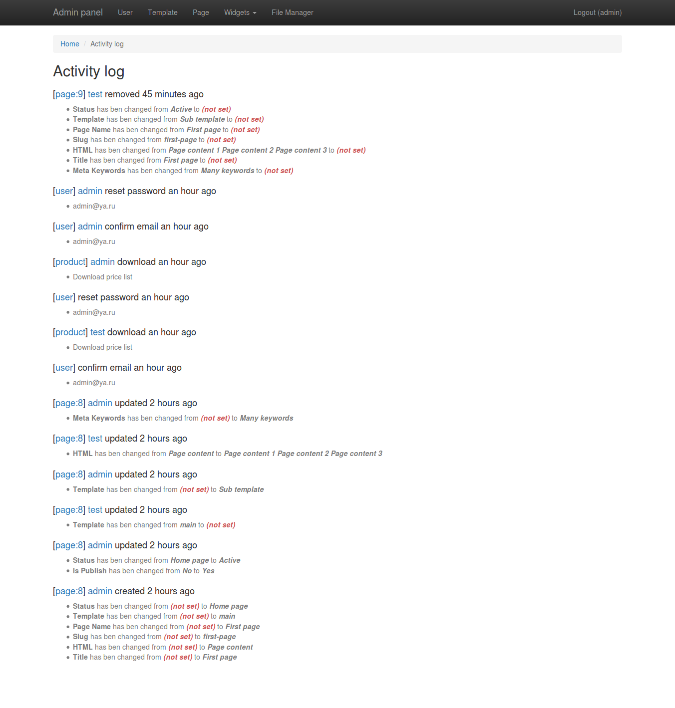

# Отображение данных

## Необходимо добавить в конфигурационный файл `config/main.php`

```php
return [
    'modules' => [
        'logger' => [
            '__class' => \lav45\activityLogger\module\Module::class,
            // Список моделей которые логировались
            'entityMap' => [
                'news' => 'common\models\News',
            ],
        ]
    ],
];
```

## Ссылки для просмотра логов

```php
// На этой странице можно просмотреть все логи
Url::toRoute(['/logger/default/index']);

// На этой странице можно просмотреть журналы действий конкретного пользователя по его `$id`
Url::toRoute(['/logger/default/index', 'userId' => 1]);

// На этой странице можно просмотреть журналы действий для всех объектов "news"
Url::toRoute(['/logger/default/index', 'entityName' => 'news']);

// На этой странице можно просмотреть журналы действий для всех объектов "news" с "id" => 1
Url::toRoute(['/logger/default/index', 'entityName' => 'news', 'entityId' => 1]);
```

## Пример отображения


